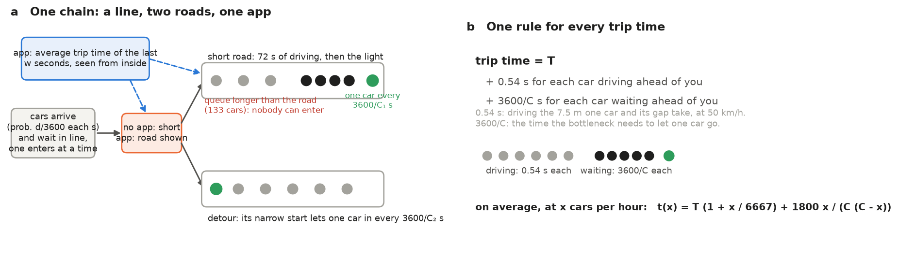
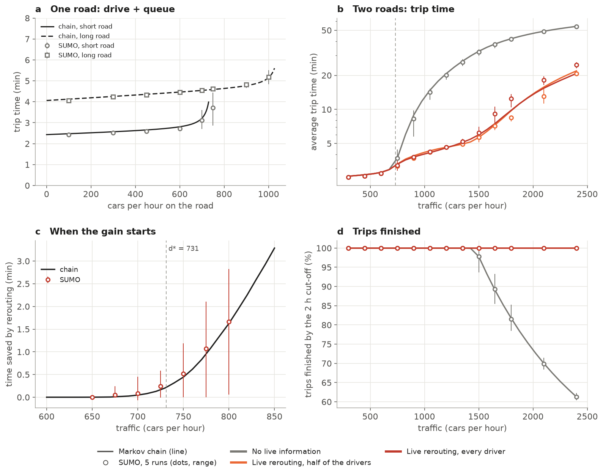
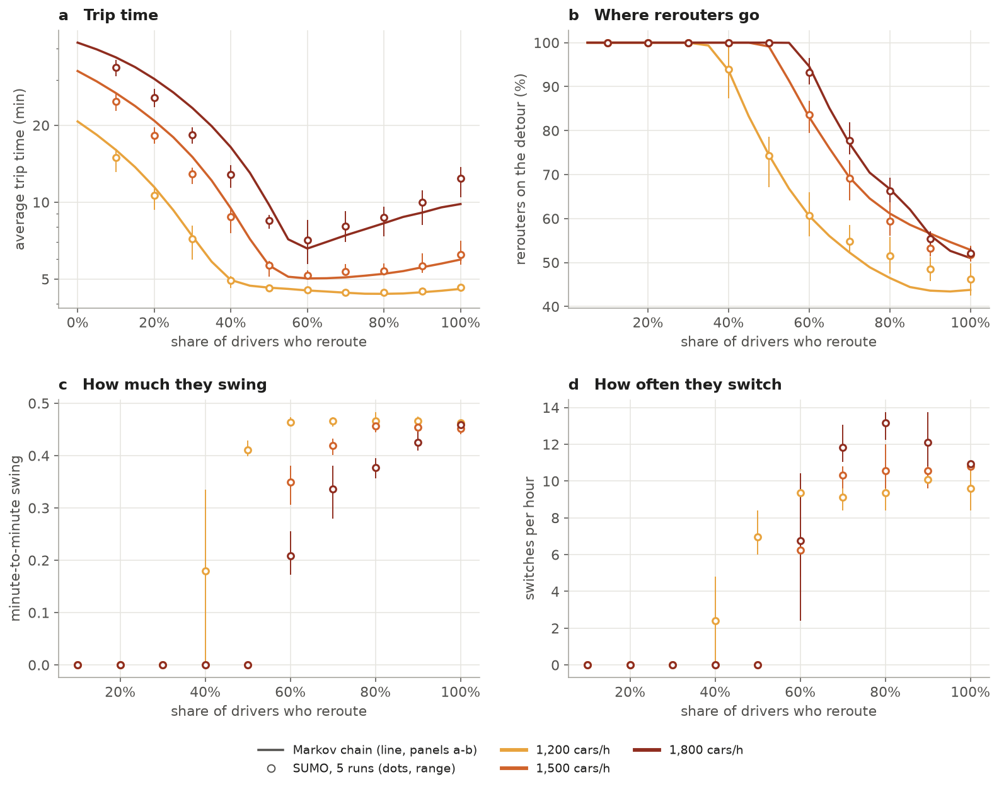
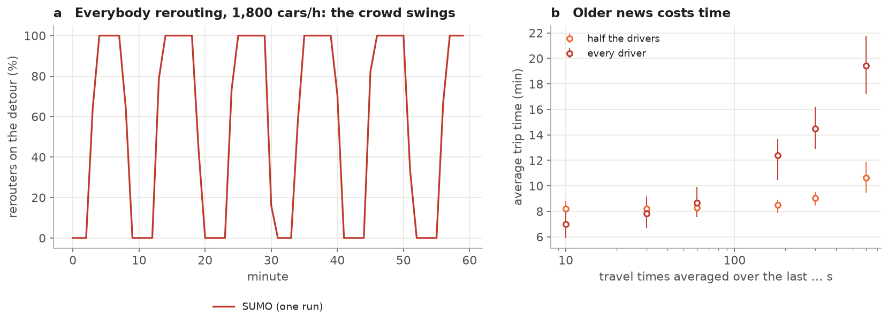
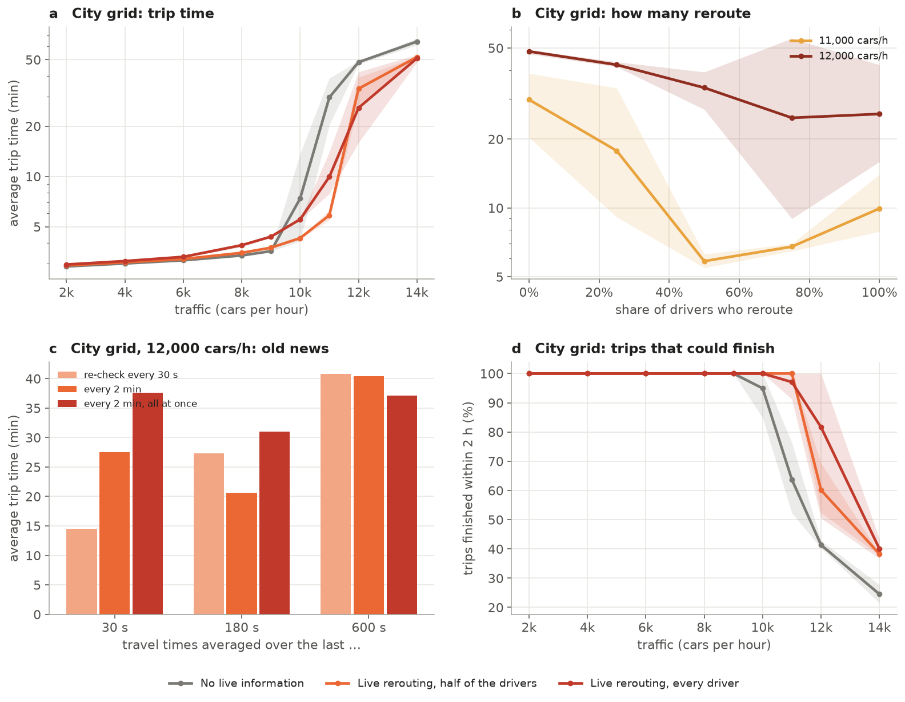
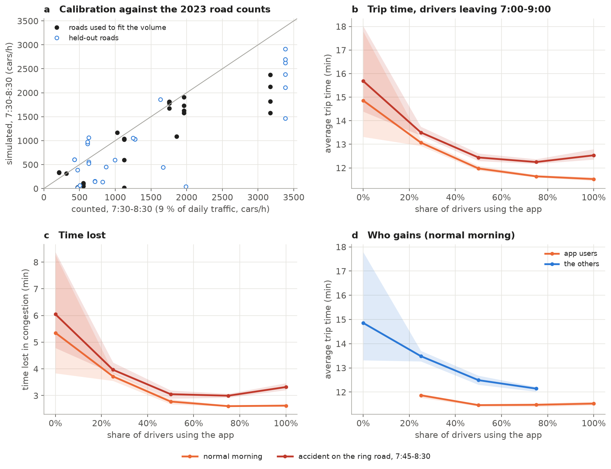
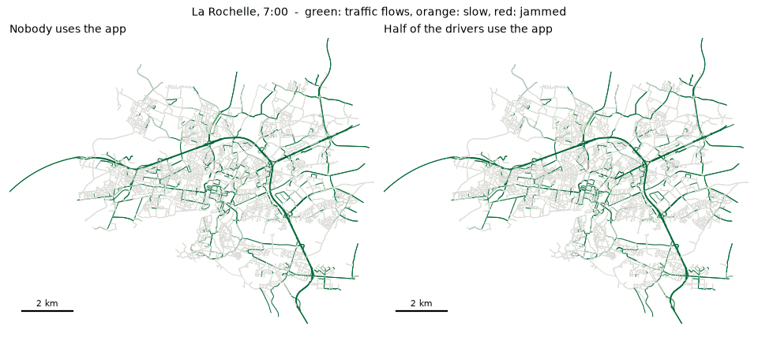

# Does live rerouting beat traffic jams? A Markov chain, SUMO and La Rochelle

Navigation apps send drivers onto another road when their usual route is jammed. This project asks
**how much this dynamic rerouting reduces travel time and congestion, and when it stops helping.**

It answers three ways: with a small **Markov chain** whose predictions were written down before being
tested blind in the traffic simulator [SUMO](https://eclipse.dev/sumo/); with controlled SUMO
experiments on two roads and a city grid; and with a **full-scale simulation of La Rochelle's morning
rush hour** built only from open data and checked against real road counts.

## Why it matters

Most drivers now follow live navigation, so rerouting decides how traffic spreads over a city. It can
clear a jam by using forgotten roads, or create new jams when thousands of drivers are sent the same way
at once. Road authorities, navigation services and drivers all need to know when it helps.

## The theory

Take a short road and a longer detour between the same two places. Each has a bottleneck that lets at
most `C` cars through per hour; driving it empty takes `T` seconds (measured once in SUMO: short road
`T₁ = 146 s`, `C₁ = 753`; detour `T₂ = 244 s`, `C₂ = 1,059`). Traffic is a Markov chain with three rules,
all taken from the network, nothing fitted (Figure 1):

1. **Every car ahead of you costs you time**: 0.54 s if it is driving (the time to drive the 7.5 m one
   car and its gap take, at 50 km/h), `3600/C` s if it is waiting at your road's bottleneck.
2. **Cars enter one at a time**; a queue longer than its road blocks the entrance.
3. **The app shows the average trip time of the last few minutes**, seen from inside the network.

Its steady state gives the answer in equations. We keep only the parts that held in **two blind tests**
(below); the chain's predictions about how often the crowd swings between roads and what stale
information costs did not hold, and are not used.

**A road is a drive plus a queue.** At `x` cars per hour a road takes on average

> **t(x) = T·(1 + x / 6,667) + 1,800·x / (C·(C − x))**

The first term is the other drivers on the road, the second the wait at a bottleneck that lets cars go at
a regular pace. The time stays nearly flat, then explodes as `x` approaches `C`: moving a few cars off a
nearly full road saves a lot, adding them to a quiet road costs almost nothing.

**Rerouting helps only above a traffic level d\*,** where the short road stops beating an empty detour,
`t₁(d*) = T₂`: **731 cars per hour** here.

**Only a share p\* of drivers needs the app.** Rerouters fill the detour until both roads take the same
time; drivers without the app stay on the short road, so beyond `p* = 1 − x / d` (`x` = cars left on the
short road at that balance) more app users have nothing left to balance: **39 %** of drivers at 1,200 cars per hour, **51 %** at 1,500, **58 %** at 1,800.

**Capacity is the hard limit.** Above `C₁ + C₂ = 1,811` cars per hour queues grow whatever the routing.

## Testing it blind

The chain's numbers for 216 situations were committed to this repository **before** SUMO was run on
fresh random seeds, with a pass rule for each; a statement holds if 80 % of its situations pass. It was
tested twice: on the two-road network (seeds 6-10), and on a variant with a 2.4 km entry road so that
queues form inside the network (seeds 11-15).

| statement | two roads | long entry road |
|---|---|---|
| a road is a drive plus a queue (`t(x)`) | 10/10 | 9/10 |
| rerouting helps only above d\* | 6/7 | 7/7 |
| app users fill the detour only as far as needed | 29/30 | 25/30 |
| trip time against the share of app users | 27/30 | 25/30 |
| trip time and trips finished against traffic | 51/54 | 47/54 |

Examples (seeds 6-10): without live information, 1,200 cars per hour take 20.6 minutes, predicted 20.6;
at 2,400 cars per hour 61 % of trips finish within two hours, predicted 61 %; with 1,500 cars per hour,
trips take 25.2 minutes when 10 % of drivers reroute and 5.2 minutes when 60 % do (predicted 26.6 and 5.0).

**Where the theory is not reliable** (tested, failed, not used): how often the crowd switches roads, what
old information costs when nearly everyone follows the app, and the routes of drivers who know the usual
traffic. SUMO's drivers keep re-checking the app while driving to the fork, which the chain leaves out.

## What we learned

**How much rerouting saves, and when it starts** (Figure 2). Below about 700 cars per hour rerouting
changes nothing; above d\* the gain grows very fast. At 1,200 cars per hour drivers without live
information take 20 minutes, rerouting drivers under 5. Without information, trips start to miss the
two-hour cut-off from 1,500 cars per hour: at 2,400 only 61 % finish, exactly what the short road's
capacity allows.

**How many drivers need it** (Figure 3). App users take the detour until it is no longer faster, then
stop; drivers without the app gain too, because the short road clears. At 1,500 cars per hour the
average trip falls from 25 minutes (10 % of drivers rerouting) to 5 minutes (60 %); more app users
change almost nothing.

**When too many follow the same advice, the crowd swings** (Figures 3c-d and 4, simulation only).
Beyond p\*, app users move as one block, all onto the detour, then all back, about ten times an hour. The
swings waste road capacity: at 1,800 cars per hour with every driver on the app, 1,441 cars per hour get
through instead of 1,811 when travel times are averaged over 3 minutes, and 1,250 with 10-minute
averages; trips then take 12 to 20 minutes, against 7 to 8 with 60 % of drivers on the app.

**On a city grid** (Figure 5, 3 runs each): rerouting costs a little in light traffic, saves the grid
near its capacity (11,000 cars per hour: 30 minutes and 64 % of trips finished without rerouting, 6
minutes and 100 % with half of the drivers), and cannot prevent the collapse beyond it.

## La Rochelle at full scale

A calibrated simulation of the real city, built only from open data (Figure 6 and the animation):
streets, lanes and signals from OpenStreetMap; residents from INSEE's 200 m population grid; jobs from the
SIRENE register of workplaces; who commutes where from INSEE's 2022 flows between communes, with the
census share of drivers (52 % in La Rochelle, 81 % around it). About 16,500 car trips leave between 7:00
and 9:00. Their volume was chosen so that rush-hour flows match the 2023 road counts on half of the
counted roads, and checked on the other half: the match is right overall (R² = 0.54 on the held-out
roads) but only rough road by road. Drivers follow the routes of people who know the usual traffic;
app users reroute live. Two mornings: a normal one, and one where an accident slows one lane of the ring
road to walking pace (the others to 20 km/h) from 7:45 to 8:30.

| drivers on the app | normal morning | time lost in jams | accident morning |
|---|---|---|---|
| none | 14.9 min | 5.4 min | 15.7 min |
| 25 % | 13.1 min | 3.7 min | 13.5 min |
| 50 % | 12.0 min | 2.8 min | 12.4 min |
| 75 % | 11.6 min | 2.6 min | 12.3 min |
| all | 11.5 min | 2.6 min | 12.5 min |

(mean trip of the drivers leaving 7:00-9:00, 3 seeds; every trip finishes by 11:00). **Live rerouting
cuts the average trip by about a fifth and halves the time lost in jams, and most of the gain comes with
the first half of the drivers**, as the theory's share p\* suggests; drivers without the app gain too
(13.5 minutes when a quarter of drivers use it, 12.1 when three quarters do). On the accident morning,
every driver on the app is slightly worse than three quarters, the first sign of herding. Part of the gain
may come from the difference between the fast model used to find the usual routes and the detailed one
used for the mornings, which the app corrects; about 1 % of cars had to be moved out of gridlocks by
SUMO.

## The answer

**How much does dynamic rerouting help?** Nothing in light traffic, and a great deal near capacity: on two
roads it cuts trips from 20 to under 5 minutes at 1,200 cars per hour. In La Rochelle's calibrated morning rush it cuts the average trip by about a fifth (14.9 to 11.5 minutes) and halves the time lost in jams.

**When does it stop helping?**
1. **Below d\*** the detour is not faster: there is nothing to gain.
2. **Beyond a share p\*** of app users, more app users bring nothing; everybody already benefits (in La Rochelle, most of the gain is reached with half of the drivers).
3. **When nearly everybody follows the same, slightly old advice**, the crowd swings between roads and
   wastes capacity (a simulation finding the simple theory does not capture).
4. **Above total capacity**, no routing serves more cars than the roads let through.

## Limits

The two-road and grid traffic is random, not measured. La Rochelle's demand is built from census commuting
flows and calibrated on estimated rush-hour counts (9 % of daily traffic): it matches them overall but
not road by road. SUMO's app follows one rule and knows the whole network; real apps also predict traffic.

## Data and code

* **Datasets** (published on Kaggle): the La Rochelle simulation (every car's trip and every street's
  traffic, inputs, calibration) and the controlled experiments with both theory tests.
* **Code**: `rerouting/markov.py` (the chain), `rerouting/theory.py` (its equations),
  `rerouting/conjectures.py` (predictions and scoring), `rerouting/experiments.py` and `rerouting/sumo.py`
  (SUMO runs), `rerouting/larochelle.py` (the city model), `rerouting/figures.py`, `rerouting/export.py`.
  Heavy runs use `jz/*.slurm` on the Jean Zay supercomputer. Tests are in `tests/`.

*Map data © OpenStreetMap contributors (ODbL). INSEE, SIRENE and road count data under Licence Ouverte.*
