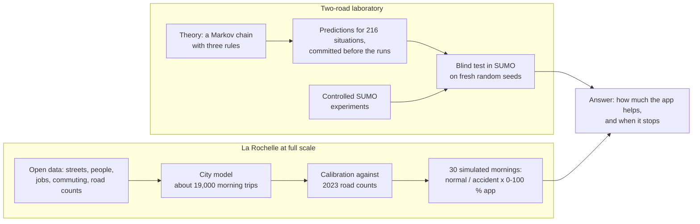
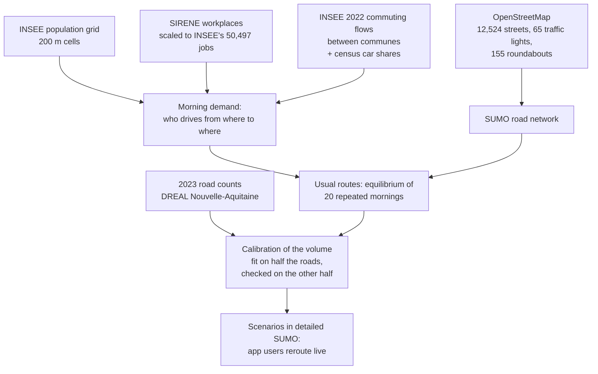
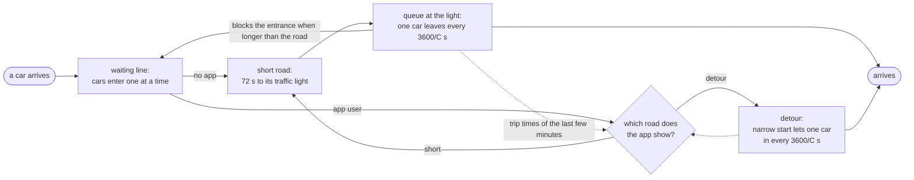

# Does Waze make traffic worse?

**Simulating La Rochelle's rush hour with and without live rerouting**


*La Rochelle on a weekday morning, 7:00 to 10:00. Left: the whole city. Middle and right: the area where the
app helps most, with nobody on the app and with half of the drivers on it. Green: traffic flows; red: jammed.*

Navigation apps like Waze send drivers onto another road when their usual route is jammed. Does that make
everybody's trip faster, or just move the jams around? And when does it stop helping? This project answers
with detailed traffic simulations ([Eclipse SUMO](https://eclipse.dev/sumo/)) in which **the same cars drive
the same morning with 0 to 100 % of drivers following a live-rerouting app**, backed by a theory that was
tested blind.

## In one minute

| drivers on the app | normal morning | time lost in jams | accident on the ring road |
|---|---|---|---|
| none | 14.9 min | 5.4 min | 15.7 min |
| 25 % | 13.1 min | 3.7 min | 13.5 min |
| 50 % | 12.0 min | 2.8 min | 12.4 min |
| 75 % | 11.6 min | 2.6 min | 12.3 min |
| everybody | 11.5 min | 2.6 min | 12.5 min |

*Average trip of the 16,500 drivers leaving between 7:00 and 9:00, full-scale La Rochelle, 3 random seeds each.*

* **The app helps a lot:** trips about a fifth shorter, time lost in jams halved.
* **Half of the drivers is enough:** beyond 50 %, more app users add almost nothing - and the drivers
  *without* the app gain too, because rerouted cars leave room on the busy roads.
* **Everybody on the app is not the best:** on the accident morning, 100 % is worse than 75 %. On two roads
  at high traffic, everybody following the same advice makes trips 74 % longer than 60 % doing so: the crowd
  swings from one road to the other.
* **It only helps when roads are nearly full:** below a traffic level the theory predicts (731 cars per hour
  on our two roads), rerouting saves almost nothing.

## What we did



The theory is about the **two-road laboratory**: it was built and tested blind there. **It was not used to
predict La Rochelle**: the city is a separate, calibrated simulation whose results come from SUMO itself.
The same effects show up in both.

## La Rochelle at full scale

### How the city was built



* **Streets**: the drivable network of La Rochelle and its ring road from OpenStreetMap, with lanes, turn
  lanes, speed limits, roundabouts and traffic lights as mapped.
* **Who travels**: every INSEE commuting flow between two communes becomes car trips, using the census
  share of workers who drive (52 % in La Rochelle, 81 % around it). A trip starts near a home (population
  grid) and ends at a workplace (SIRENE register); commuters from farther away enter by the real entry roads
  (N11, N137, the Île de Ré bridge...), chosen by their measured traffic. Departures spread from 6:30 to 9:30.
* **Volume**: two numbers are fitted so that rush-hour flows match 9 % of the 2023 daily counts: the share
  of daily commuters driving this morning (it also stands for school runs and errands) and the through
  traffic. They are chosen on half of the counted roads and checked on the other half: right overall
  (R² = 0.54 on the held-out roads), rough road by road.
* **Drivers' usual routes**: the equilibrium of 20 repeated mornings (SUMO's duaIterate): the routes of
  commuters who know the usual traffic.
* **Scenarios**: detailed SUMO simulation from 6:30 to 11:00. Drivers without the app follow their usual
  route; app users are rerouted every minute on the travel times of the last 3 minutes. Two mornings: a
  normal one, and one where an accident slows a lane of the ring road to walking pace (the others to
  20 km/h) from 7:45 to 8:30. Each is run with 0, 25, 50, 75 and 100 % of drivers on the app and 3 seeds.
* **Where it ran**: the Jean Zay supercomputer (IDRIS), 10 simulations in parallel.

| source | what it gives | licence |
|---|---|---|
| [OpenStreetMap](https://www.openstreetmap.org) | streets, lanes, signals | ODbL |
| [INSEE Filosofi 2021, 200 m grid](https://www.insee.fr/fr/statistiques/7655475) | where people live | Licence Ouverte |
| [SIRENE and its geolocation](https://www.data.gouv.fr/datasets/geolocalisation-des-etablissements-du-repertoire-sirene-pour-les-etudes-statistiques) | where they work | Licence Ouverte |
| [INSEE 2022 home-work flows](https://www.insee.fr/fr/statistiques/8582949) and [2023 census](https://www.insee.fr/fr/statistiques/2011101?geo=COM-17300) | who commutes where, who drives | Licence Ouverte |
| [DREAL Nouvelle-Aquitaine, TMJA 2023](https://www.data.gouv.fr/datasets/nouvelle-aquitaine-trafic-routier-2023-du-reseau-autoroutier-concede-du-reseau-national-et-du-reseau-departemental-lineaire) | average daily traffic on counted roads | open, no restriction |
| [geo.api.gouv.fr](https://geo.api.gouv.fr) | commune outlines and centres | Licence Ouverte |


*Figure 6: (a) simulated against counted rush-hour flows; (b) trip time and (c) time lost against the share
of app users; (d) app users and the others.*

**Caveat.** Drivers' usual routes come from SUMO's fast queue-based mode, the mornings from its detailed
mode; part of the app's gain may correct that difference. About 1 % of cars had to be moved out of gridlocks.

## The theory, and where it holds

Take a short road and a longer detour between the same two places, each with a bottleneck that lets `C`
cars through per hour and takes `T` seconds to drive when empty (measured once in SUMO). Traffic is a Markov
chain whose state changes every second by three rules, all taken from the network, nothing fitted:



1. **Every car ahead of you costs you time**: 0.54 s if it is driving (the time to drive the 7.5 m one car and
   its gap take, at 50 km/h), `3600/C` s if it is waiting at your road's bottleneck.
2. **Cars enter one at a time**; a queue longer than its road blocks the entrance.
3. **The app shows the average trip time of the last few minutes**, seen from inside the network.

Its steady state gives three results:

> **A road is a drive plus a queue:** &nbsp; `t(x) = T·(1 + x/6667) + 1800·x / (C·(C − x))`

It stays nearly flat, then explodes as the traffic `x` approaches `C`: moving a few cars off a nearly full
road saves a lot, adding them to a quiet road costs almost nothing.

> **Rerouting helps only above d\*,** where the short road stops beating an empty detour: **731 cars per hour**.

> **Only a share p\* of drivers needs the app,** `p* = 1 − x/d`: **39 %** at 1,200 cars per hour, **51 %** at
> 1,500, **58 %** at 1,800. Beyond it, more app users have nothing left to balance.

### Tested blind

The chain's numbers for 216 situations were committed to this repository **before** SUMO was run on fresh
random seeds. A statement holds if 80 % of its situations pass. Two tests: the two-road network (seeds 6-10)
and the same network with a 2.4 km entry road (seeds 11-15). We keep only what held in both:

| statement | two roads | long entry road |
|---|---|---|
| a road is a drive plus a queue | 10/10 | 9/10 |
| rerouting helps only above d\* | 6/7 | 7/7 |
| app users fill the detour only as far as needed | 29/30 | 25/30 |
| trip time against the share of app users | 27/30 | 25/30 |
| trip time and trips finished against traffic | 51/54 | 47/54 |

**Not covered by the theory** (tested, failed): how often the crowd swings between roads, what old
information costs when nearly everyone follows the app, and the routes of drivers who know the usual
traffic. In SUMO, drivers keep re-checking the app while driving to the fork; the chain decides once.

## The two-road laboratory


*Figure 2: one road's trip time against its traffic (a); two roads: trip time (b), the gain from rerouting
near d\* (c) and trips finished (d). Lines: the theory; dots: SUMO.*


*Figure 3: against the share of app users, trip time (a) and share of app users on the detour (b) with the
theory; how much (c) and how often (d) the crowd swings, SUMO only.*


*Figure 4: when every driver follows the app at 1,800 cars per hour, the crowd swings from road to road (a),
and older information makes it costlier (b).*

On a **6 × 6 city grid** the same pattern holds: rerouting costs a little in light traffic, saves the grid
near its capacity (11,000 cars per hour: 30 minutes and 64 % of trips finished without rerouting, 6 minutes
and 100 % with half of the drivers), and cannot prevent the collapse beyond it (Figure 5).


## So, does Waze make traffic worse?

**Mostly no.** It shortens trips a lot when roads are nearly full, and it helps the drivers who do not use it.
It stops helping:
1. **below d\***, when there is no jam to avoid;
2. **beyond a share p\*** of app users, when more users have nothing left to balance;
3. **when nearly everybody follows the same, slightly old advice**, the crowd swings between roads and wastes
   capacity - there it can make traffic worse;
4. **above the network's capacity**, when no routing can serve more cars than the roads let through.

## Data, notebooks and code

* **Dataset** on Kaggle (`tudoropr/does-live-rerouting-beat-traffic-jams`, private for now): five beginner
  tables in plain units, and the full data - every car of the 30 La Rochelle mornings, every street every
  5 minutes, the open-data inputs, the calibration and all two-road and grid runs.
* **Notebooks** on Kaggle: a step-by-step exploration for beginners, and the theory with its tests
  (`kaggle/`).
* **Code** (`rerouting/`): `markov.py` (the chain), `theory.py` (its equations), `conjectures.py`
  (predictions and scoring), `experiments.py` and `sumo.py` (SUMO runs), `larochelle.py` (the city model),
  `figures.py`, `export.py` (the dataset). Heavy runs: `jz/*.slurm`. Tests: `tests/`.

```bash
python -m rerouting.larochelle fetch && python -m rerouting.larochelle prepare   # open data
python -m rerouting.larochelle calibrate && python -m rerouting.larochelle routes  # volume, usual routes
python -m rerouting.larochelle run && python -m rerouting.larochelle gif          # 30 mornings, animation
python -m rerouting.experiments two_road grid                                      # the laboratory
python -m rerouting.figures && python -m rerouting.export 2                        # figures, dataset
```

## Limits

This is a model, not a measurement of real traffic. La Rochelle's hourly counts are estimated from daily ones
and the calibration is rough road by road; signal timings are SUMO's defaults; parking and pedestrians are not
modelled. SUMO's app knows the whole network and follows one rule; real apps also predict traffic.
*Not affiliated with Waze or Google: "Waze" stands for any live-rerouting app.*

*Code: MIT licence. Map data © OpenStreetMap contributors (ODbL); INSEE, SIRENE and road-count data under
Licence Ouverte.*
