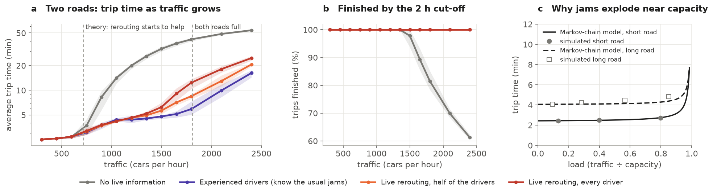
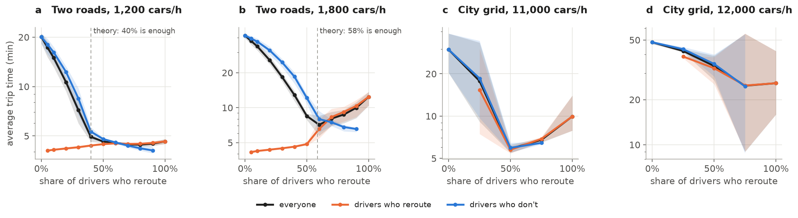
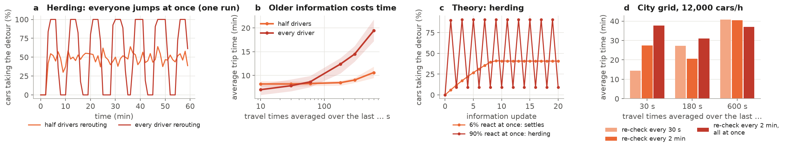
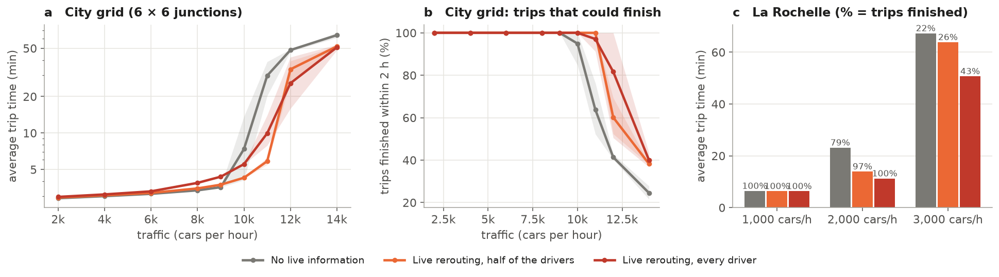

# Does live rerouting beat traffic jams? A study with simple theory and SUMO

Navigation apps send drivers onto a different road when their usual route is jammed. This project asks
**how much this dynamic rerouting really reduces travel time and congestion, and when it stops helping.**
It combines a little mathematics (a Markov chain for queues, and equilibria on two roads) with traffic
simulations in [SUMO](https://eclipse.dev/sumo/): a simple two-road network where the theory can be
checked number by number, a 6 × 6 city grid, and the real street map of central La Rochelle.

## Why it matters

Most drivers now follow live navigation, so rerouting is no longer an individual trick: it changes how
traffic spreads over a whole city. It can clear a jam by using forgotten side roads, or create new jams
when thousands of drivers are sent the same way at once. Knowing when it helps matters for road
authorities (should they share live traffic data, and how often?), for navigation services (should
they tell everybody the same thing?), and for anyone deciding whether to trust the app.

## A little theory

**A road is a drive plus a queue.** Driving an empty road takes a time `T`. Somewhere on it, a
bottleneck (here a traffic light) lets at most `C` cars through per hour: its *capacity*. Cars arrive at
the bottleneck at random and leave one at a time, so the number of cars waiting is a **Markov chain**:
it goes up by one when a car arrives and down by one when a car leaves. Solving its balance equations
gives the average wait exactly, and so

> travel time = T + load ÷ (capacity − traffic), where load = traffic ÷ capacity.

The wait is negligible for a long time, then explodes as traffic approaches capacity (Figure 1c): taking
a few cars off a nearly full road saves a lot of time, while adding them to a quiet road costs almost
nothing. This formula, with `T` and `C` measured in the simulator, is all the theory below needs.

**Two roads.** A short road and a longer detour join the same two places. Without live information,
everybody takes the short road. With rerouting, drivers move to the detour until both roads take the
same time (Wardrop's *user equilibrium*). The model then predicts:

1. **Light traffic: no gain.** Rerouting starts to help only when the wait on the short road exceeds the
   extra driving time of the detour. For our roads this happens at **717 cars per hour**.
2. **Busy traffic: large gains**, because each car moved to the detour avoids a queue that grows fast.
3. **Not everybody needs to reroute.** A precise share of drivers is enough to balance the two roads
   (**40 %** at 1,200 cars per hour, **58 %** at 1,800); beyond it, more rerouting changes nothing,
   and the drivers who do not reroute benefit too, because the short road clears.
4. **When both roads are full**, rerouting still helps but cannot stop the queues from growing.

**Stale information and herding.** Drivers decide with travel times that are a few minutes old. If a
fraction `g` of them react at the same moment, the share `x` of cars on the detour follows
`x(next) = (1 − g) x + g × (the choice they make from the previous travel times)`. Linearising this rule
around its balance point shows that it settles only if `g` stays below a threshold (`g < 2 / (1 + K)`,
where `K` grows when drivers react sharply and when delays are steep). Above it, the crowd swings from
one road to the other: **herding** (Figure 3c; a qualitative illustration, not fitted to SUMO).

## What we learned

The same trips are used for every kind of driver; curves are averages over 5 random seeds (3 on the
grid and in La Rochelle), and bands show the spread between seeds. Traffic enters during one hour and
every run stops two hours after the start: trips still on the road at that cut-off are counted as
unfinished, with the time spent so far, so averages with unfinished trips are lower bounds.

**1. Rerouting only pays when roads are close to full, and then it pays enormously.** (Figure 1)
Below about 600 cars per hour every driver takes 2.5 to 3 minutes whatever the information. The gain
appears between 600 and 750 cars per hour, where the theory places it (717). Beyond, drivers without
live information queue on the short road: 20 minutes at 1,200 cars per hour, and from 1,500 some
trips are still unfinished at the cut-off. With live rerouting the same trips take 4 to 6 minutes up
to 1,500 cars per hour. The Markov-chain formula matches the simulated roads below capacity
(Figure 1c).

**2. Part of the drivers is enough, and more can be worse.** (Figure 2)
Most of the benefit is reached near the share the theory predicts: at 1,200 cars per hour, 40 % of
rerouting drivers bring the average from 20 to 5 minutes (4.4 minutes at 80 %). The drivers *without*
the app gain almost as much as those with it, because the rerouters clear the short road for them. At
1,800 cars per hour the best result is reached with 60 % of drivers rerouting in every seed (7 minutes);
with 100 % it rises to 12 minutes, and from 70 % on, the drivers who do *not* reroute are faster than
those who do. The city grid shows the same thing: at 11,000 cars per hour, trips take 29 minutes with
nobody rerouting, 6 minutes with half of the drivers, and 10 minutes with all of them. At 12,000 cars
per hour the grid is already overloaded and the pattern changes: more rerouting keeps helping (48
minutes and 41 % of trips finished with nobody rerouting, 34 minutes with half, 26 minutes and 82 % with
everybody), but the three seeds disagree strongly (with 75 % of drivers rerouting, from 9 to 55 minutes).
The right share grows with traffic: the more cars must leave the shortest paths, the more drivers must
be willing to move.

**3. When everybody reacts to the same information, the crowd swings from road to road.** (Figure 3)
With every driver rerouting on travel times averaged over the last 3 minutes, the detour is alternately
empty and full, in cycles of 8 to 10 minutes (Figure 3a shows one run). With half of the drivers
rerouting, the split stays calm around 50 %. This is the herding the lagged-decision model describes
when too many drivers react at once. Fresher information limits the damage: with every driver
rerouting, trips take 7 minutes when travel times are averaged over 10 seconds and 19 minutes when they
are averaged over 10 minutes. The city grid near collapse (12,000 cars
per hour, everybody rerouting, 2 seeds, Figure 3d) points the same way: trips take 15 minutes when
drivers re-check every 30 seconds with travel times averaged over 30 seconds, but 37 to 41 minutes with
10-minute averages. Re-checking every 2 minutes all at the same moment is worse than re-checking at
staggered moments (38 against 28 minutes with 30-second averages). These grid runs vary a lot between
seeds.

**4. Drivers who know the usual jams do about as well as live rerouting, and much better in heavy
traffic.** "Experienced" drivers use fixed routes learned by replaying the same hour until nobody can
gain by changing route. At moderate traffic they match live rerouting (4.4 against 4.2 minutes at
1,050 cars per hour); at 1,800 cars per hour they take 6 minutes, against 8.5 with half of the drivers
rerouting live and 12 with all of them (Figure 1a). Live information matters most when congestion is
*unusual*; for a daily rush hour, experience already spreads traffic well and avoids herding. (Their
routes were learned on the very traffic they then face, which favours them.)

**5. On a city grid and on a real map.** (Figure 4) On the 6 × 6 grid, rerouting costs a little in
light traffic (at 9,000 cars per hour: 3.6 minutes without rerouting, 4.4 with every driver rerouting,
because of needless detours), saves the network near its capacity (at 11,000 cars per hour, 64 % of
trips finish without rerouting and all of them with half of the drivers rerouting), and cannot prevent
the collapse beyond it (at 14,000 cars per hour, at most 40 % of trips finish whatever the drivers
do). The streets of central La Rochelle
tell the same story: at 1,000 cars per hour trips average about 6 minutes whatever the drivers do; at
2,000, trips take 23 minutes and 79 % finish without rerouting, against 11 minutes and 100 % with every
driver rerouting; at 3,000 the centre is gridlocked (22 % of trips finish without rerouting, 43 % with
everybody rerouting).

**So when does rerouting stop helping?**
* when roads are far from full: there is nothing to avoid, and rerouting can even cost a little;
* when enough drivers already reroute: beyond that share, more rerouting brings nothing, or makes
  things worse by herding;
* when many drivers react to the same old information at once;
* when drivers already know the usual jams from experience;
* when the whole network is beyond capacity: rerouting still saves some trips, but cannot prevent the
  collapse.

## Limits

These are simulations with random trips, not measurements of real traffic; the La Rochelle map is used
for its street layout, not its real traffic. SUMO's rerouting follows one rule (the fastest route on
recently observed speeds); real apps also predict traffic, which should reduce herding. The theory
assumes steady traffic and random arrivals: it explains the shape of the results and the thresholds,
not exact minutes. The grid and La Rochelle use only 3 seeds (2 for Figure 3d), and some grid results near collapse
depend on a single seed.

*Code: `rerouting/` (theory, SUMO interface, experiments, figures) with tests in `tests/`; raw results
in `results/`. Map data © OpenStreetMap contributors (ODbL).*
